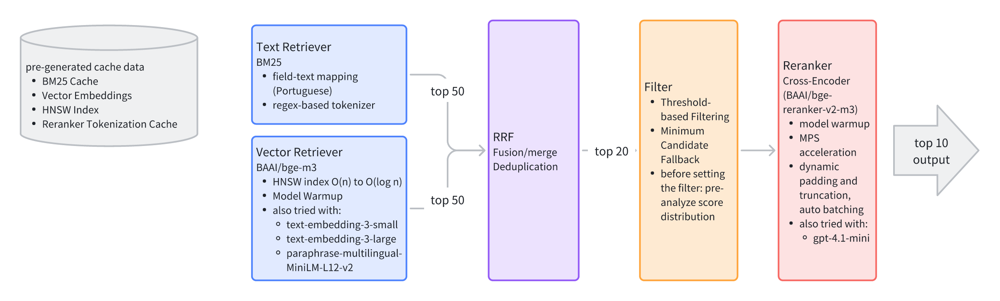

## Architecture Design



## Test Set Construction

1. **Query Categorization**  
   The 100 queries are categorized into four groups:  
   - `queries_location_based.csv`  
   - `non_food.csv`  
   - `specific_name.csv`  
   - `vague_concept.csv`  
   as shown in the directory `data/test/query_category`.

2. **Query Selection**  
   From each category, representative queries are selected, a total of **30 queries** are used as the **test set** (`30_queries.csv`).

3. **Candidate Pool Generation**  
   For each query, perform both **vector retrieval** and **text (BM25) retrieval**, each returning **top-50** results.  
   After deduplication, all retrieved items form the **candidate pool**,  
   with a maximum size of `30 × 100 = 3000` pairs.

4. **Ground Truth Scoring**  
   Each `(query, item)` pair is rated for semantic relevance on a **0–10 scale** using **GPT-4.1-mini**.


```
================================================================================
  ✓ Updated 2576 scores

Statistics:
  • Total pairs: 2576
  • Pairs with scores: 2576
  • Pairs without scores: 0
  • Average score: 3.52/10
  • High relevance (≥5): 751 (29.2%)
  • Low relevance (<5): 1825 (70.8%)

================================================================================
Scoring completed!
================================================================================
```

### ❌ Failed Attempts

1. **Random Sampling**  
   Randomly selected 10 queries and 500 items for scoring →  
   The 500 items were too random, resulting in extremely sparse relevance scores, most pairs received 0 and were unusable.

2. **GPT-Generated Relevant Items**  
   Based on (1), used GPT to generate strongly related items for the 10 queries and mixed them into the 500-item pool →  
   The relevance was *too strong* and overly specific, causing the text retriever (BM25) to easily capture them, thus failing to reflect true *semantic* retrieval performance.

3. **Manual Labeling**  
   Tried human labeling →  
   Too much data to handle manually and time-consuming.

## Components and Experiments

Detailed evaluation reports are available in `artifacts/eval_runs`.  
If you want to run the experiments yourself, execute the scripts under `scripts/evaluation`, but make sure to complete the prerequisites first and verify the parameter settings in each script’s `main` function.

### Experiment Environment

```
Hardware Configuration:
  Platform: macOS-15.6.1-arm64-arm-64bit-Mach-O
  Processor: arm
  Machine: arm64
  Architecture: 64bit
  CPU Count: 8
  CPU Frequency: 3504.00 MHz
  Total Memory: 16.00 GB
  GPU: Apple Metal (MPS)
  GPU Memory: N/A
  Python Version: 3.13.2
```


### Text Retriever (BM25)

| Average (ms) | Max (ms) | Min (ms) |
|:------------:|:--------:|:--------:|
|     2.75     |   4.44   |   1.79   |

| Metric | Precision | Recall | NDCG |
|:--|--:|--:|--:|
| **@K = 5** | 0.3933 | 0.2111 | 0.5920 |
| **@K = 10** | 0.3900 | 0.2850 | 0.6225 |

### Vector Retriever


| Model name                                                      | Average (ms) | Max (ms) | Min (ms) |
|-----------------------------------------------------------------|:------------:|:--------:|:--------:|
| **BAAI/bge-m3**                                                 |    59.25     |  284.47   |  33.55  |
| **sentence-transformers/paraphrase-multilingual-MiniLM-L12-v2** |    22.67     |  149.13  |   8.42   |

| Model name | Metric | Precision | Recall | NDCG | 
|------------|:--------|:---------:|:------:|:------:|
|      **BAAI/bge-m3**          | **@K=5**  |  0.5067   | 0.2244 | 0.6697 | 
|      **BAAI/bge-m3**          | **@K=10** |  0.4700   | 0.3112 | 0.6963 | 
|       **sentence-transformers/paraphrase-multilingual-MiniLM-L12-v2**                        | **@K=5**  |  0.2267   | 0.1517 | 0.3351 |
|       **sentence-transformers/paraphrase-multilingual-MiniLM-L12-v2**                        | **@K=10** |  0.1933   | 0.1774 | 0.3125 | 

I also tried both text-embedding-3-small and text-embedding-3-large, but embedding through the API takes around 1 second per query, which is too slow. It also depends on the network speed and OpenAI’s service performance, and the token usage is billed, making it quite expensive for large-scale datasets and high concurrency queries.

### Hybrid Retriever

Concurrent text retriever + vector retriever (top-50 + top-50) → RRF fusion (top-20) → filtering → reranker → top-10


| Metric | Average (ms) | Max (ms) | Min (ms) |
|:--|--:|--:|--:|
| **Overall Latency** | 1851.93 | 4071.48 | 1124.13 |


| Stage | Avg (ms) | Max (ms) | Min (ms) | Notes |
|:--|--:|--:|--:|:--|
| **BM25 Retrieval** | 16.80 | 162.80 | 7.32 | Text-based retrieval |
| **Vector Retrieval** | 82.39 | 357.26 | 42.31 | HNSW + Embedding Search |
| **RRF Fusion / Merge** | 0.16 | 0.27 | 0.09 | Reciprocal Rank Fusion |
| **Cross-Encoder Re-ranking** | 1767.78 | 4013.13 | 761.19 | Re-ranking with BGE Reranker |


| Metric | Precision | Recall | NDCG |
|:--|--:|--:|--:|
| **@K = 5** | 0.5733 | 0.2494 | 0.7141 |
| **@K = 10** | 0.5033 | 0.3726 | 0.7321 |

### Evaluation and Reflection


| Metric | My Result | Typical Range (Ref: MS MARCO / BEIR / MTEB) | Evaluation |
|:--|:---------:|:--:|:----------:|
| **NDCG@10** |   0.73    | 0.60–0.80 |    Good    |
| **Precision@10** |   0.50    | 0.40–0.60 |    Good    |
| **Recall@10** |   0.37    | 0.30–0.50 |  Moderate  |
| **Latency** |   1.85s   | <1s Ideal |   Slow   |

| Reference                         | Link                                                                                                 |
|-----------------------------------|------------------------------------------------------------------------------------------------------|
| MS MARCO Leaderboard              | [https://microsoft.github.io/msmarco/leaderboard/](https://microsoft.github.io/msmarco/leaderboard/) |
| BEIR Leaderboard                  | [https://github.com/beir-cellar/beir#leaderboard](https://github.com/beir-cellar/beir#leaderboard)   |
| HuggingFace Retrieval Leaderboard | [https://huggingface.co/spaces/mteb/leaderboard](https://huggingface.co/spaces/mteb/leaderboard)     |


The overall latency (≈1.85s) is relatively high compared to the ideal target (<1s).

1. **Limited GPU parallelism on macOS (MPS)**  
   Apple’s Metal Performance Shader (MPS) backend currently does not support true parallel inference or concurrent batching. 
   As a result, multiple batches of Cross-Encoder re-ranking are executed sequentially rather than concurrently, leading to longer total inference time.
2. **Lack of GPU acceleration (no CUDA available)**  
   The experiments were run on a **MacBook Air (M2, 16GB)**.  
   Without CUDA or discrete GPU, computation relies mainly on CPU and limited MPS acceleration, resulting in higher latency.


